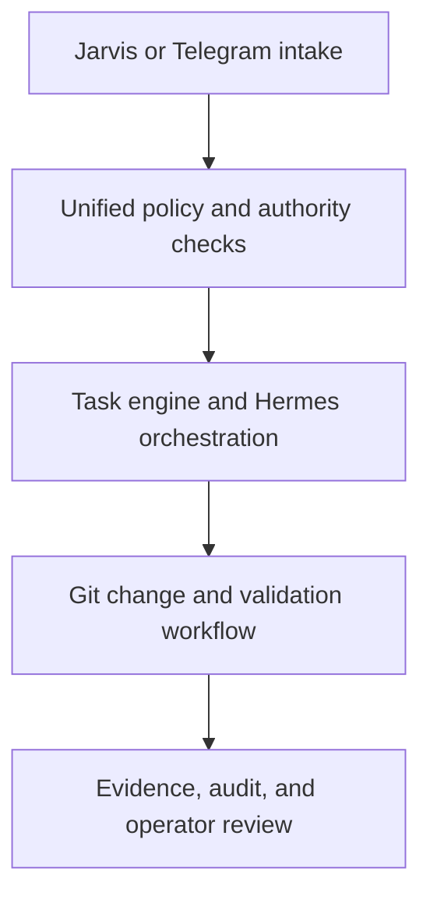

# Blackspire Command

> **Verified internal engineering demonstration — not a paid client deployment or a claim of production operation**

Blackspire Command is an AI-assisted operations control plane designed to turn a bounded request into a traceable engineering workflow: intake, policy evaluation, approval when required, worker execution, validation, Git evidence, and a documented result.

It was built and directed by **Carlos Pearson / Blackspire Helix Group** as an internal demonstration of how AI-enabled work can remain observable, interruptible, and subject to human authority.

## The problem

AI tools can generate useful work quickly, but business operators still need answers to practical questions:

- What exactly was requested?
- Was the action allowed?
- Did a person need to approve it?
- Which worker or provider attempted it?
- What changed?
- Which checks passed or failed?
- Can work be stopped without silently continuing?
- Is there evidence for the final result?

Blackspire Command explores those questions as a working, test-backed system rather than a presentation-only concept.

## Demonstrated workflow

The verified demonstration includes:

- queued task intake with worker-only claiming;
- deterministic policy checks before provider or worker dispatch;
- persisted approvals with resume, rejection, and expiry behavior;
- cancellation and emergency-stop boundaries;
- staged Hermes orchestration with stored plans and subtasks;
- isolated Git branch, edit, validation, and commit handling;
- persisted command results, changed files, provider attempts, usage, and final evidence;
- SQLite-backed sessions, approvals, rate limits, audit records, tasks, and attachments;
- restart-persistence and session-revocation checks;
- evidence export and operator-visible status;
- a mobile Jarvis PWA;
- a Telegram bridge exercised with mocked transport;
- redaction and network-isolation checks.

## Verification highlights

These results come from separate preserved acceptance milestones. They are listed individually and are not added together as one test count.

| Milestone | Verified result |
|---|---:|
| Command foundation and hardening | 114 passed, 0 failed |
| Unified Jarvis/Telegram input regression | 139 passed, 0 failed, 0 skipped |
| Manual iPhone Safari acceptance | 11 passed, 0 failed |

The iPhone acceptance used disposable state, mock providers, mock Telegram mode, stripped credentials, blocked non-loopback egress, and a temporary tunnel that was removed after testing.

The unified-input validation confirmed shared conversation state across Jarvis and Telegram, idempotent replay handling, provider-policy denial, emergency stop, cancellation lifecycle, bounded outbox failure, cross-channel binding protection, redaction, and zero recorded external-call attempts.

## Human-control boundaries

Blackspire Command is designed around explicit limits:

- high-risk work can pause for approval;
- rejected or expired approvals do not execute;
- emergency stop prevents new claims;
- cancellation prevents later stages from continuing;
- protected actions are denied before dispatch;
- credentials, deployment, spending, repository administration, host-security changes, trading, and funds movement remain outside unattended authority;
- mock and live states are represented separately.

## Demonstration boundaries

This case study does **not** claim:

- a paid customer deployment;
- an active production Command service;
- verified live Telegram transport;
- verified live OpenAI, Anthropic, Codex, or Claude provider execution for the acceptance runs described here;
- horizontally scaled or multi-host persistence;
- business results or client revenue attributable to the system.

External-service adapters and deployment tooling exist in the supporting repository, but this portfolio entry is limited to the isolated behavior and evidence actually verified.

## Evidence

- [Foundation delivery and 114-test acceptance](https://github.com/houseomegakennels-bit/blackspire-helix-group/blob/main/BLACKSPIRE_DELIVERY.md)
- [Unified-input validation evidence](https://github.com/houseomegakennels-bit/blackspire-helix-group/blob/main/UNIFIED_INPUT_VALIDATION_EVIDENCE.md)
- [iPhone acceptance results](https://github.com/houseomegakennels-bit/blackspire-helix-group/blob/main/JARVIS_UI_IPHONE_ACCEPTANCE_RESULTS.md)
- [Supporting Blackspire repository](https://github.com/houseomegakennels-bit/blackspire-helix-group)

## What this demonstrates

Blackspire Command is evidence that Carlos can scope a larger automation system, preserve approval boundaries, coordinate implementation, insist on repeatable verification, document limitations, and hand off work with an auditable record.

For smaller buyer engagements, the same approach can be applied to n8n workflows, browser automation, CRM operations, intake systems, and internal AI tools without requiring the entire Command architecture.
